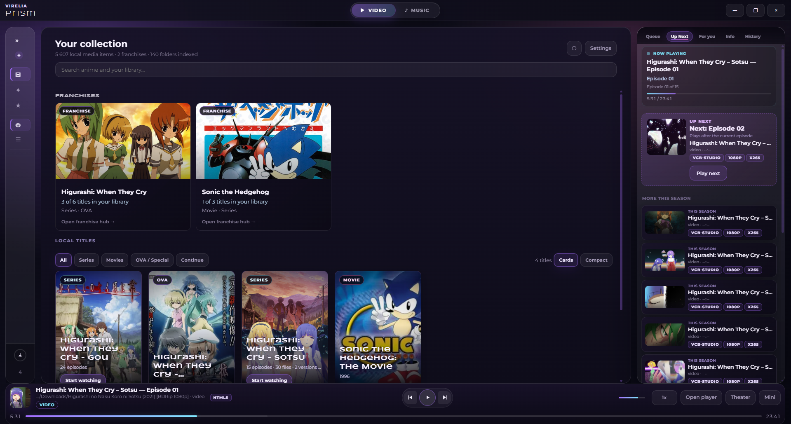
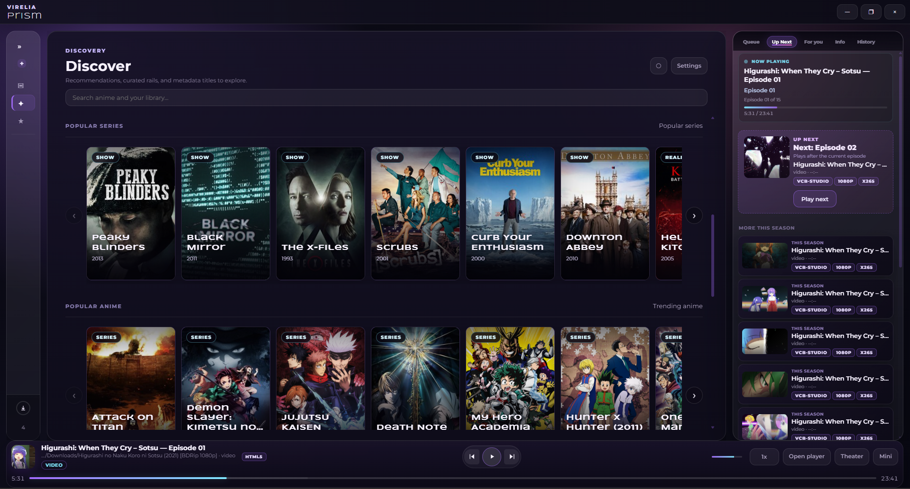
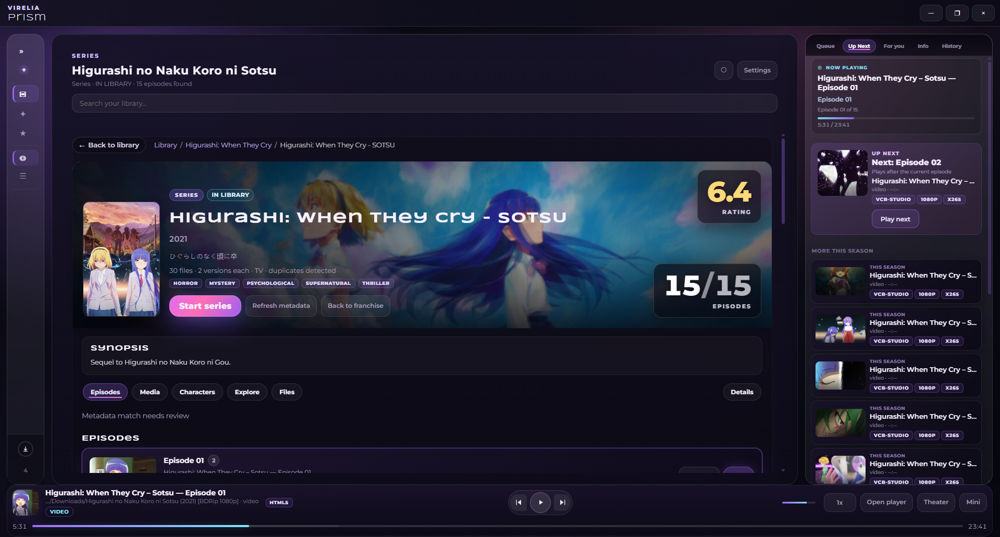
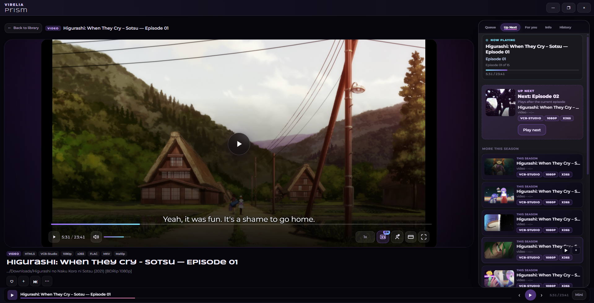
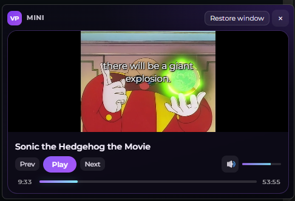
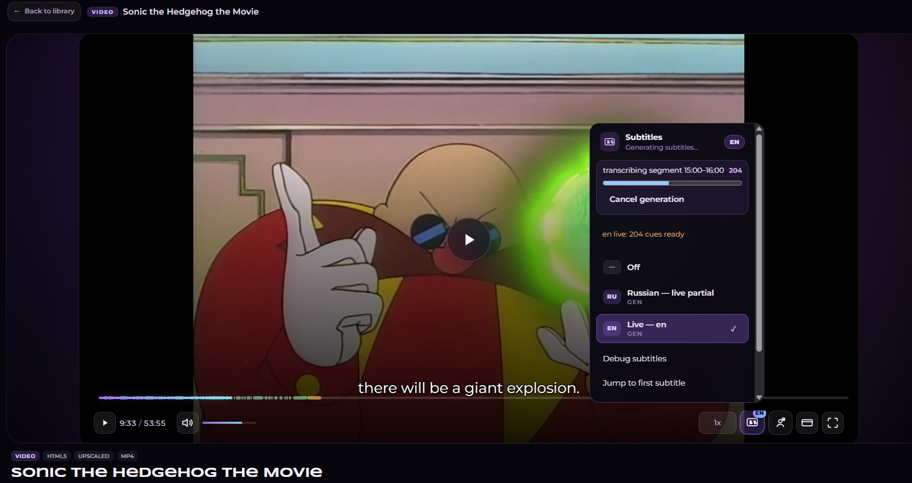
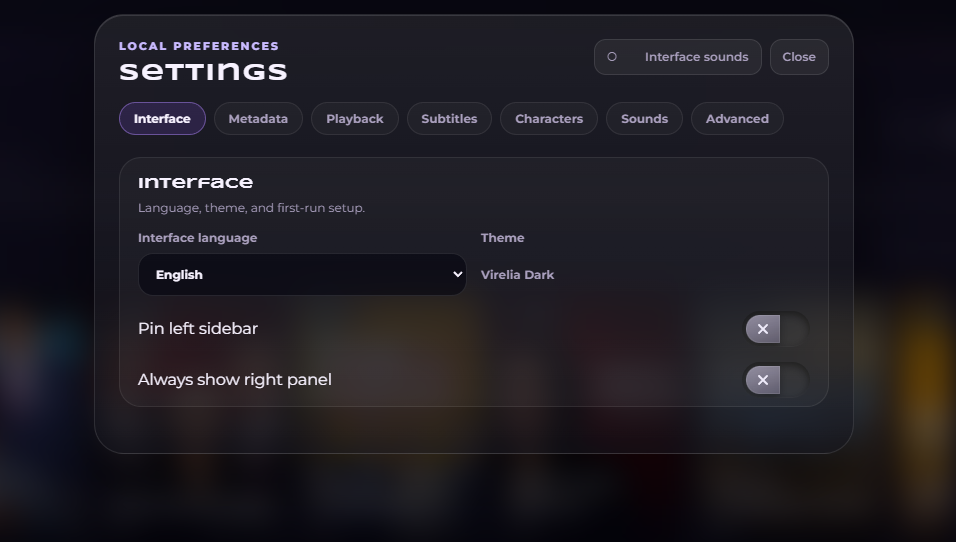

# Virelia Prism

**A Windows-first desktop media library for local video and audio collections.**

Virelia Prism targets large personal libraries—anime, series, and music—with rich title pages, queue workflows, local playback, optional online metadata, and an on-device subtitle pipeline. The UI is a custom cinematic shell (library, watch mode, and mini player) backed by a Rust core and a React renderer.

<p align="center">
  
</p>

<p align="center">
  <a href="#features">Features</a> ·
  <a href="#screenshots">Screenshots</a> ·
  <a href="#architecture">Architecture</a> ·
  <a href="#tech-stack">Stack</a> ·
  <a href="#getting-started">Getting started</a> ·
  <a href="PRIVACY.md">Privacy</a>
</p>

---

## Features

### Library

- Import folders and individual files via native dialogs or drag-and-drop
- Recursive library scan with progress events and skipped-file reporting
- Two browse modes: **Titles** (grouped works) and **Files** (flat list)
- Video / music content modes with filters and sorting
- Virtualized lists and grids tuned for libraries with tens of thousands of files
- Snapshot-based startup: cached library loads first, background rescan when stale
- Franchise hubs, recently added, favorites, and title detail pages with episode progress

### Playback

- Local audio and video playback through the desktop shell
- Library mode preview, dedicated **watch / cinema** layout, and **mini player**
- Queue with reorder, pin, repeat, and shuffle; manual and smart playlists
- Playback session restore, resume positions, and watch history
- HTML5 playback in Tauri via asset protocol; optional **mpv** integration in the Electron dev shell
- Keyboard shortcuts for transport, navigation, queue, favorites, search, and settings

### Metadata & discovery

- Optional online metadata: posters, backdrops, trailers, screenshots, synopsis, ratings
- Providers: Prism Metadata Gateway, AniList, Jikan, TMDB, TVMaze
- Discover feed with personalized and trending rails; watchlist for catalog titles
- Local + online search; external search shortcuts (Google, Bing, DuckDuckGo, custom URL)
- Disk-backed title metadata and image cache; offline mode when online lookup is disabled

### Subtitles

- Discover embedded, external sidecar, and generated subtitle tracks (VTT, SRT, ASS)
- Extract embedded tracks and import external files
- On-device generation via **whisper.cpp** with GPU auto-detection and progressive preview
- Translation backends: built-in LibreTranslate (localhost), local HTTP/command, custom API
- Speaker colors, character color inference and overrides, timing offset, auto track selection

### Media intelligence

- Filename parsing for seasons, episodes, specials, release tags, and duplicates
- Grouping files into titles and episodes with version deduplication (quality scoring)
- Smart up-next recommendations from local library signals
- Identity and parser result caching across rescans

### UX & localization

- Custom frameless window, three-column shell, smart right panel (queue / up next / info)
- UI sounds, toast notifications, context menus, first-run onboarding wizard
- English and Russian UI (`auto` detects ru / uk / be)
- Focus-visible accessibility and `prefers-reduced-motion` support

---

## Screenshots

### Library & discovery

<p align="center">
  
  <br />
  <sub>Discover — metadata rails and catalog recommendations</sub>
</p>

<p align="center">
  
  <br />
  <sub>Title detail — episodes, progress, synopsis, and artwork</sub>
</p>

### Playback

<p align="center">
  
  <br />
  <sub>Watch mode — cinema layout, subtitles, technical tags, up next</sub>
</p>

<p align="center">
  
  <br />
  <sub>Mini player — compact window with playback controls</sub>
</p>

### Subtitles & settings

<p align="center">
  
  <br />
  <sub>Subtitles — track picker, Whisper generation, translation</sub>
</p>

<p align="center">
  
  <br />
  <sub>Settings — playback, subtitles, discovery, and advanced options</sub>
</p>

---

## Architecture

Virelia Prism splits responsibilities between a **thin React UI** and a **Rust backend** exposed through Tauri IPC. The renderer does not access the filesystem directly; it calls a stable `window.prism` adapter shared by the Tauri shell and the Electron dev shell.

```
┌─────────────────────────────────────────────────────────────────┐
│  React 19 renderer (Vite)                                       │
│  features · components · playback · mediaIntelligence · i18n    │
│  createStore state · custom route store · @tanstack/react-virtual│
└────────────────────────────┬────────────────────────────────────┘
                             │ invoke() + events
┌────────────────────────────▼────────────────────────────────────┐
│  Tauri 2 (virelia_prism_lib)                                    │
│  commands · services · LibraryStore · subtitle pipeline         │
│  FFmpeg · ffprobe · whisper.cpp · thumbnail queue               │
└────────────────────────────┬────────────────────────────────────┘
                             │
┌────────────────────────────▼────────────────────────────────────┐
│  Local persistence (%APPDATA%/com.virelia.prism)                │
│  settings.json · library.snapshot.json · subtitle/thumb/metadata│
│  caches · whisper models                                        │
└─────────────────────────────────────────────────────────────────┘
```

| Layer | Responsibility |
|-------|----------------|
| **Renderer** | UI, routing, playback orchestration, metadata providers, search index, localStorage user data |
| **Rust services** | Folder scan, media filtering, subtitles, thumbnails, settings I/O, subprocess management |
| **IPC** | ~45 commands; events for scan progress, library changes, subtitle generation, model downloads |
| **Persistence** | JSON snapshots and disk caches |

---

## Tech stack

| Area | Technologies |
|------|----------------|
| UI | React 19, TypeScript 6, Vite 8 |
| Desktop | Tauri 2, `@tauri-apps/api`, dialog plugin |
| Backend | Rust 2021 — serde, walkdir, ureq, chrono |
| Lists at scale | `@tanstack/react-virtual` |
| Media tooling | FFmpeg / ffprobe, whisper.cpp, optional mpv |
| Translation | LibreTranslate (built-in local server, optional) |
| Tests | Vitest, `cargo test` |
| CI | GitHub Actions on `windows-latest` |

---

## Getting started

### Requirements

- **Windows** (primary target)
- **Node.js** 24+
- **Rust** stable (for Tauri builds and `cargo test`)

### Native dependencies (subtitles)

Large binaries are not stored in git. After clone, place them locally:

| Asset | Location |
|-------|----------|
| `ffmpeg.exe`, `ffprobe.exe` | `src-tauri/resources/bin/windows/` |
| `whisper-cli.exe` (+ optional CUDA DLLs) | `src-tauri/resources/bin/windows/` |
| `ggml-base.bin` | `src-tauri/resources/models/` |

See `src-tauri/resources/bin/windows/README.txt`, `src-tauri/resources/models/README.txt`, and `scripts/setup-whisper-gpu.ps1`.

### Install & run

```powershell
git clone https://github.com/chlorida/Virelia-Prism.git
cd Virelia-Prism
npm install
npm run tauri:dev
```

### Verify & build

```powershell
npm run typecheck
npm test
npm run test:rust
npm run tauri:build
```

### First run

1. Complete the onboarding wizard (language, metadata preferences, optional Whisper model setup).
2. Import a media folder from the library sidebar or drag-and-drop files.
3. Enable online metadata in Settings for posters and Discover — see [`PRIVACY.md`](PRIVACY.md).

---

## Project layout

```
virelia-prism/
├── src/renderer/          # React UI, features, playback, mediaIntelligence
├── src/main/              # Electron main process (dev shell)
├── src/shared/            # Shared types, i18n, defaults
├── src-tauri/             # Rust backend, commands, services, resources
├── docs/screenshots/      # README screenshots
├── public/sounds/         # UI sound assets
└── scripts/               # Whisper and translation setup helpers
```

---

## Privacy

Network behavior, local data storage, and offline mode are documented in [`PRIVACY.md`](PRIVACY.md).

---

## License

All rights reserved. Source is provided for review and portfolio purposes unless a separate license is published.

---

<p align="center">
  <sub>Virelia Prism · local-first media library</sub>
</p>
